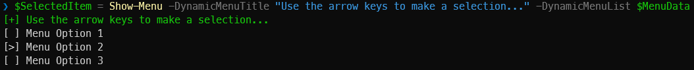

# InteractivePSMenu
Generates a dynamic console menu featuring a list of options, allowing users to navigate and select choices using their keyboard arrows.

## Description
The Show-Menu function is used to display a dynamic menu in the console. It takes a title and a list of options as parameters. The title is optional and defaults to "Please make a selection...". The list of options is mandatory. The function will display the title in green, followed by the list of options. The user can then make a selection from the options provided.

## Usage
```
# This example shows how to use the Show-Menu function to display a menu with a custom title and three options.
$MenuData += [PSCustomObject]@{Id = 1; DisplayName = "Menu Option 1"}, `
                     [PSCustomObject]@{Id = 2; DisplayName = "Menu Option 2"}, `
                     [PSCustomObject]@{Id = 3; DisplayName = "Menu Option 3"}
Show-Menu -DynamicMenuTitle "Main Menu" -DynamicMenuList $MenuData
```
